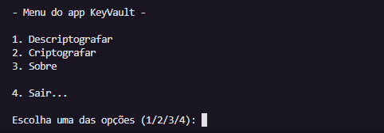

<!-- Projeto Finalizado -->
# 🔐 KeyVault - Cifra de César
<p align="center">
  <!-- Contador de linguagens do GitHub -->
  
  <!-- Tamanho do repositório no GitHub -->
  
  <!-- Licença do GitHub -->
  
</p>

<div align="center">
  
</div>

## 🎯 Objetivo do Projeto
O **KeyVault** é um programa desenvolvido em Python que implementa a Cifra de Deslocamento Unitária, uma variação da Cifra de César. O objetivo é permitir a criptografia e descriptografia de textos usando duas chaves distintas, garantindo um nível adicional de segurança.

## ⚙️ Como Funciona
- **Descriptografia**: O texto cifrado pode ser revertido ao original usando as mesmas chaves, através do processo inverso de deslocamento.
- **Criptografia**: O texto original é criptografado utilizando duas chaves, que aplicam deslocamentos diferentes para cada caractere.
- **Interatividade**: Menu permite criptografar, descriptografar ou aprender sobre o projeto.

## 💻 Acessibilidade
O **KeyVault** foi projetado com simplicidade e acessibilidade em mente. O menu do programa é fácil de navegar e as instruções são claras, permitindo que qualquer usuário, mesmo sem experiência em criptografia, possa utilizá-lo.

## 🛠 Tecnologias Utilizadas
- **Python**: Linguagem de programação utilizada para desenvolver o script.
- **Biblioteca OS**: Utilizada para limpar o terminal e melhorar a experiência do usuário.
- **Biblioteca Time**: Implementada para adicionar pausas e temporizações no fluxo do programa.

## 📚 Recursos Úteis
- [Documentação do Python](https://docs.python.org/3/) - Guia completo da linguagem e suas bibliotecas.

## 🧭 Guia de Implementação
1. **Clone o Repositório**
   - Para obter uma cópia local do projeto, execute o seguinte comando no terminal:
   ```bash
   git clone https://github.com/devAndreotti/APS-02.git
   ```
2. **Acesse o Diretório do Projeto**
   - Navegue até o diretório onde o repositório foi clonado:
   ```bash
   cd pasta-do-projeto
   ```
3. **Execute o Programa**
   - Agora, execute o script principal para iniciar o programa:
   ```bash
   python CifraDeDeslocamento.py
   ```

## 💪 Como Contribuir
Contribuições são bem-vindas! Siga estas etapas para colaborar:
1. Faça um fork do projeto.
2. Crie uma nova branch para sua feature: `git checkout -b feature/nome-feature`.
3. Commit suas mudanças: `git commit -m 'Adiciona nova feature'`.
4. Envie para a branch: `git push origin feature/nome-feature`.
5. Abra um Pull Request.

## 📝 Nota
Este projeto foi desenvolvido como parte de um trabalho em grupo para a faculdade, realizado uma vez a cada semestre. O trabalho envolve a criação de soluções práticas e aplicáveis que demonstrem o conhecimento adquirido ao longo do curso.

<br>

---

<p align="center">
  Desenvolvido por <a href="https://github.com/seuUsuario">Ricardo Andreotti Gonçalves</a> 🧑‍💻
</p>

---
